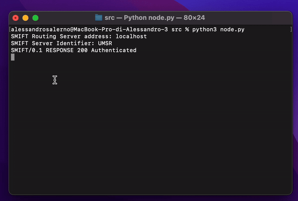

    

    <h1 align="center">System for Minecraft Interserver Financial Telecommunications</h1>

SMIFT, or _System for Minecraft Interserver Financial Telecommunications_, is a software and regulatory framework created by the UMSR Minecraft Server to facilitate interserver financial transactions, currency exchange and messaging.

# SMIFT Demo
This is a tiny python implementtion of the SMIFT Routing Server and SMIFT Node using a cut-down version of SMIFTP 0.1.

**NOTE:** This implementation is not final and does **NOT** follow the SMIFT Common Execution Policy.

    

## Documentation
Documentation can be found in this repo's [wiki](https://github.com/Alessandro-Salerno/SMIFT/wiki).

