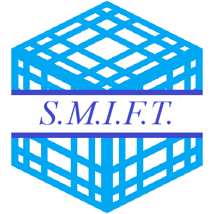

    

    <h1 align="center">System for Minecraft Interserver Financial Telecommunications</h1>

SMIFT, or _System for Minecraft Interserver Financial Telecommunications_, is a software and regulatory framework created by the UMSR Minecraft Server to facilitate interserver financial transactions, currency exchange, and messaging.

Once finalised, SMIFT will allow any Minecraft server—regardless of size, version, financial/economic/political system—to engage in commerce with others. SMIFT's design should allow for seemless integration with pre-existing infrastructure and, given the right circumstances, works for other videogames too.

## Transparency through decentralisation
SMIFT is designed to act **exclusively** as an intermediary between servers (ideally represented by their central bank). Clearing, exchange, settlement, and dispute processes are routed through SMIFT and sent to the relevant counterparties based on a series of parameters.

SMIFT does not keep customer accounts or other sensitive information and **is not responsible for users' activity**. Due to its open-source nature, SMIFT is also **NOT** a single network: anyone can host a SMIFT Routing Server and create their own SMIFT Network. Game Servers are also allowed to join multiple SMIFT Networks if they see fit.

## Development cycle and release dates
SMIFT is a hobby project built, much like [NSE Market System](https://github.com/Alessandro-Salerno/MC-UMSR-NSE-Market-System), to improve the UMSR Minecraft Server. As such, development may be slow and inconclusive.

Development of the SMIFT Protocol and architecture started in May 2024. Reference implementations of the SMIFT Routing Server and the relevant Spigot plugins are currently under development.

## SMIFT Demo
A demo of SMIFT is available in the [demo branch](https://github.com/Alessandro-Salerno/SMIFT/tree/demo).

## Documentation
Documentation can be found in this repo's [wiki](https://github.com/Alessandro-Salerno/SMIFT/wiki).

